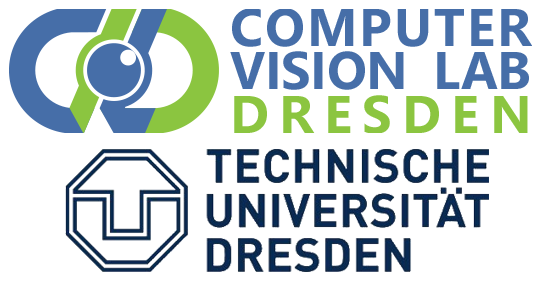
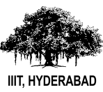
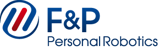

I am a PhD student at Visual Learning Lab (HCI, Uni-Heidelberg) with Prof. Carsten Rother, interested in scene understanding through Computer Vision.
Currently, I am focusing on creating realistically rendered data useful to train deep neural networks. Earlier, I worked on estimating optic flow and disparity for outdoor driving scenes.
I did my Master's at Robotics Research Center, IIIT-Hyderabad with Prof. K Madhava Krishna, where I worked on object search in indoor environments.

<b>News</b>

* One paper accepted to ICCV 2017 - Comparing recognition granularities for object scene flow estimation.

<b>I am privileged to be associated with the following</b>

<table text-align="center">
<tr><td align="center"></td> <td align="center"></td>  <td align="center"></td>  <td align="center"></td>  <td align="center"></td> </tr>
<tr><td align="center">PhD student</td><td align="center">Bachelor's &amp; Master's</td><td align="center">Intern</td><td align="center"> Intern</td><td align="center">Intern</td></tr>
</table>

