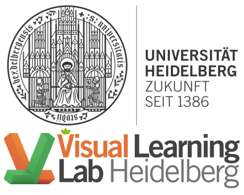

I am a PhD student with [Prof. Carsten Rother](https://hci.iwr.uni-heidelberg.de/vislearn/people/carsten-rother/) at [Visual Learning Lab (University of Heidelberg)](https://hci.iwr.uni-heidelberg.de/vislearn/) and co-advised by [Prof. Andreas Geiger](https://avg.is.tuebingen.mpg.de/person/ageiger). My research is in the field of Computer Vision.  
I focus on developing algorithms and data for semi/self-supervised learning.  
I did my Master's at [Robotics Research Center, IIIT-Hyderabad](https://robotics.iiit.ac.in/) with Prof. K Madhava Krishna, where I worked on object search in indoor environments.

**Email :** siva.mustikovela@iwr.uni-heidelberg.de

<b>News</b>

* Our work on self-supervised viewpoint learning from image collections estimation is accepted CVPR 20  
* Interned at NVIDIA Research from May - November 2019
* 2 papers accepted at ACCV 18, instance aware 6D object pose estimation [[pdf](/docs/ipose.pdf)] and geometry aware realistic image synthesis[[pdf](/docs/gis.pdf)]
* Our work on exploring recognition granularities to improve object scene flow estimation is accepted at ICCV 17  [[pdf](/docs/iccv17.pdf)]
* Our work on efficient data augmentation with synthetic objects to train CNNs is accepted in IJCV 18 [[pdf](https://arxiv.org/abs/1708.01566)]
* Our work on photo-realistic augmentation of images with synthetic objects to train CNNs is accepted at BMVC 17 [[pdf](/docs/Alhaija2017BMVC.pdf)]

<b>Publications</b>
  

<table>
  <tr>
    <td width="25%">        </td>
    <td width="70%">    <a href="/docs/ssv_cvpr20.pdf"> 
    <strong>Self-Supervised Viewpoint Learning From Image Collections</strong> </a>   
    <strong>Siva Karthik M</strong>, <a href="https://varunjampani.github.io/"> Varun Jampani </a>, <a href="https://research.nvidia.com/person/shalini-gupta"> Shalini De Mello </a>, <a href="https://www.sifeiliu.net/"> Sifei Liu </a>, <a href="http://www.umariqbal.info/"> Umar Iqbal </a>, Carsten Rother, <a href="http://jankautz.com/"> Jan Kautz </a>  
    <strong> CVPR 20 </strong> <a href="/docs/ssv_cvpr20.pdf"> [Paper]</a> <a href="https://research.nvidia.com/publication/2020-03_Self-Supervised-Viewpoint-Learning"> [Project]</a> <a href="https://github.com/NVlabs/SSV"> [Code]</a> &nbsp;  
    </td> 
  </tr>
</table>

<table>
  <tr>
    <td width="25%">        </td>
    <td width="70%">    <a href="/docs/ipose.pdf"> 
    <strong> iPose: Instance-Aware 6D Pose Estimation of Partly Occluded Objects </strong> </a>   
    <strong>Siva Karthik M*</strong>, Omid Hosseini Jafari*, Karl Pertsch, Eric Brachmann, Carsten Rother  
    <strong> ACCV 18 </strong> <a href="/docs/ipose.pdf"> [Paper] </a> &nbsp; *equal contribution 
    </td> 
  </tr>
</table>

<table>
  <tr>
    <td width="25%">        </td>
    <td width="70%">    <a href="/docs/iccv17.pdf"> 
    <strong>Bounding Boxes, Segmentations and Object Coordinates: How Important is Recognition for 3D Scene Flow Estimation in Autonomous Driving Scenarios?</strong> </a>   
    <strong>Siva Karthik M*</strong>, Aseem Behl*, Omid Hosseini Jafari*, Hassan Abu Alhaija, Carsten Rother, Andreas Geiger  
    <strong> ICCV 17 </strong> <a href="/docs/iccv17.pdf"> [Paper] </a> &nbsp; *equal contribution    
    </td> 
  </tr>
</table>

<table>
  <tr>
    <td width="25%">        </td>
    <td width="70%">    <a href="/docs/gis.pdf"> 
    <strong> Geometric Image Synthesis </strong> </a>   
    Hassan Abu Alhaija, <strong>Siva Karthik M</strong>, Andreas Geiger, Carsten Rother  
    <strong> ACCV 18 </strong> <a href="/docs/gis.pdf"> [Paper] </a> <a href="https://drive.google.com/file/d/1A1GkR2xCdUb1ORHh7bEqxr8fRH0kM7Am/view"> [video] </a> &nbsp;
    </td> 
  </tr>
</table>
  
<table>
  <tr>
    <td width="25%">        </td>
    <td width="70%">    <a href="/docs/AbuAlhaija2018_Article_AugmentedRealityMeetsComputerV.pdf"> 
    <strong> Augmented Reality Meets Computer Vision : Efficient Data Generation for Urban Driving Scenes</strong> </a>   
    Hassan Abu Alhaija, <strong>Siva Karthik M</strong>, Lars Mescheder, Andreas Geiger, Carsten Rother  
    <strong> IJCV 18 </strong> <a href="/docs/AbuAlhaija2018_Article_AugmentedRealityMeetsComputerV.pdf"> [Paper] </a>    
    </td> 
  </tr>
</table>

<table>
  <tr>
    <td width="25%">        </td>
    <td width="70%">    <a href="/docs/Alhaija2017BMVC.pdf"> 
    <strong> Augmented Reality Meets Deep Learning for Car Instance Segmentation in Urban Scenes </strong> </a>   
    Hassan Abu Alhaija, <strong>Siva Karthik M</strong>, Lars Mescheder, Andreas Geiger, Carsten Rother  
    <strong> BMVC 17 </strong> <a href="/docs/Alhaija2017BMVC.pdf"> [Paper] </a>    
    </td> 
  </tr>
</table>

<table>
  <tr>
    <td width="25%">        </td>
    <td width="70%">    <a href="/docs/siva_et_al_eccvw_2016.pdf"> 
    <strong> Can Ground Truth Label Propagation from Video help Semantic Segmentation? </strong> </a>   
    <strong>Siva Karthik M</strong>, Michael Yang, Carsten Rother  
    Video Seg. Workshop,<strong> ECCV 16 </strong> <a href="/docs/siva_et_al_eccvw_2016.pdf"> [Paper] </a>    
    </td> 
  </tr>
</table>

<table>
  <tr>
    <td width="25%">        </td>
    <td width="70%">    <a href="/docs/Suryansh_etal_ICRA_14.pdf"> 
    <strong> Markov Random Field based Small Obstacle Discovery over Images </strong> </a>   
    <strong>Siva Karthik M*</strong>, Suryansh Kumar*, K Madhava Krishna  
    <strong> ICRA 14 </strong> <a href="/docs/Suryansh_etal_ICRA_14.pdf"> [Paper] </a> *equal contribution   
    </td> 
  </tr>
</table>

<table>
  <tr>
    <td width="25%">        </td>
    <td width="70%">    <a href="/docs//Siva_etal_ICVGIP_14.pdf"> 
    <strong> Guess from Far, Recognize when Near: Searching Floor for Small Objects </strong> </a>   
    <strong>Siva Karthik M</strong>, Sudhanshu Mittal, K Madhava Krishna  
    <strong> ICVGIP 14 </strong> <a href="/docs//Siva_etal_ICVGIP_14.pdf"> [Paper] </a>  <a href="https://www.youtube.com/watch?v=4ZpH4LM7EO0"> [video] </a>   
    </td> 
  </tr>
</table>

<b>I am privileged to be associated with the following</b>

<table text-align="center">
<tr><td align="center"></td> <td align="center"></td>  <td align="center"></td>  <td align="center"></td>  <td align="center"></td> </tr>

<tr><td align="center">PhD</td><td align="center">Bachelor's &amp; Master's</td><td align="center">Intern</td><td align="center"> Intern</td><td align="center">Intern</td></tr>
</table>

